# WaveRyder

## Wave Ryder, ride waves with style and stunts.

# Stunt Guide
## Boosted
**Click on the boost button**

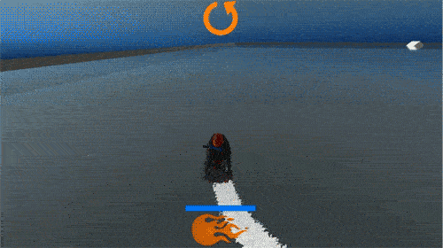

## Back-Flip

## Front-Flip

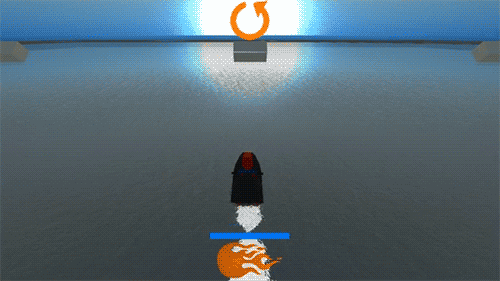

## Right-360

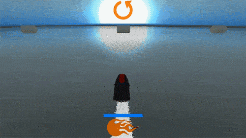

## Left-360

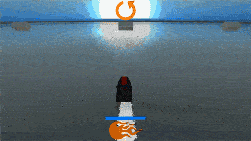

## Tunnel-Right

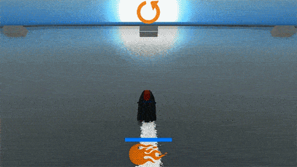

## Tunnel-Left

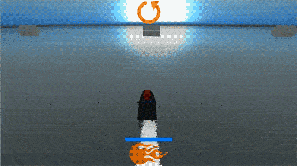

## Screenshots

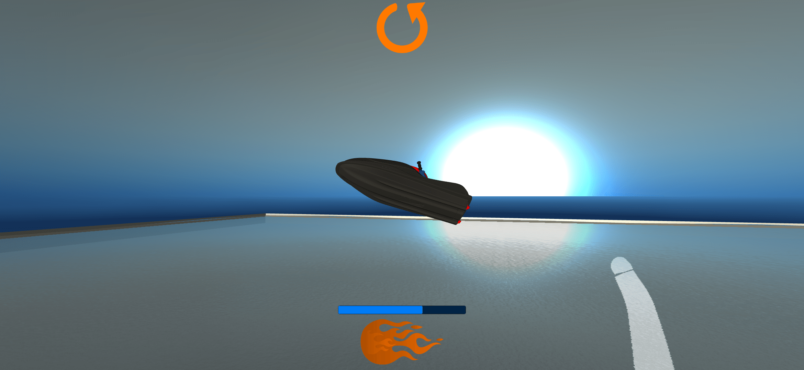
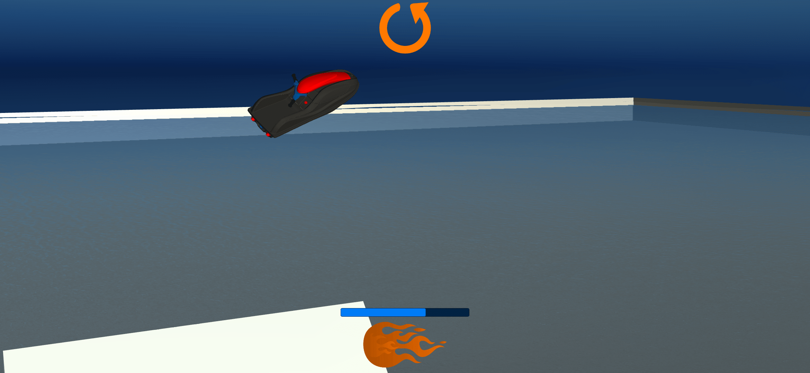
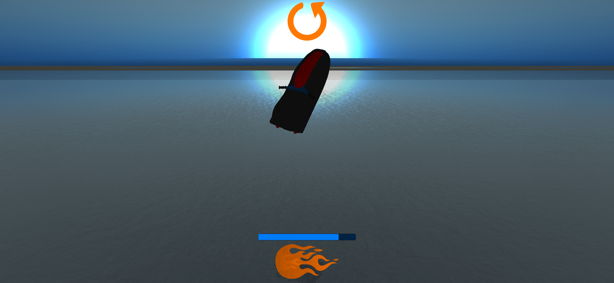
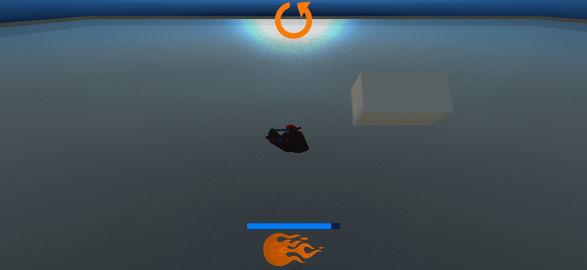
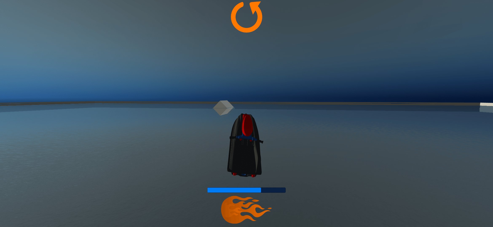
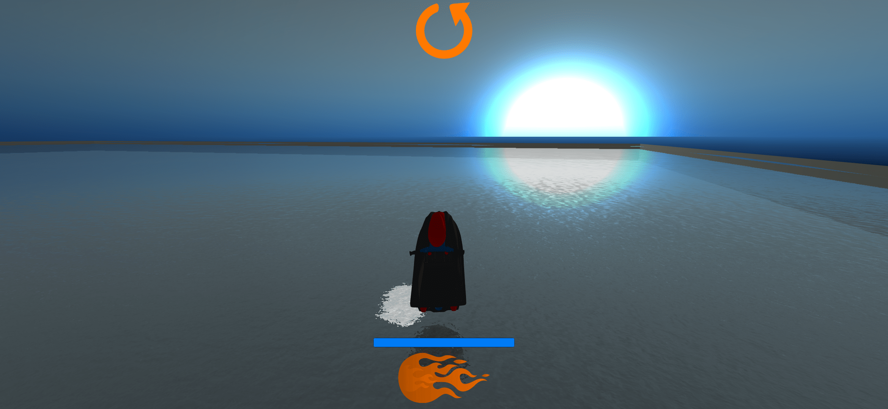
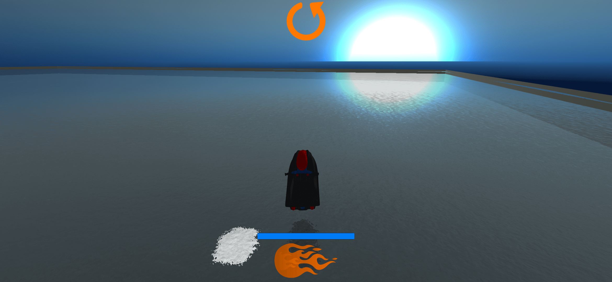
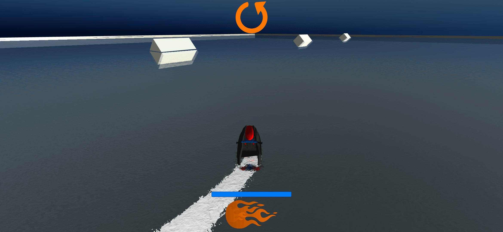
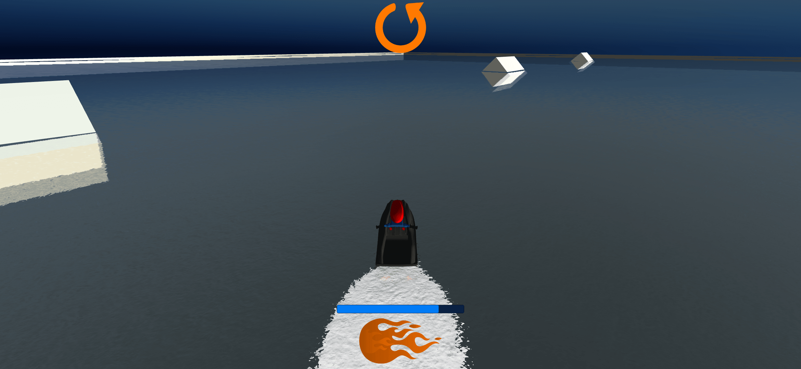
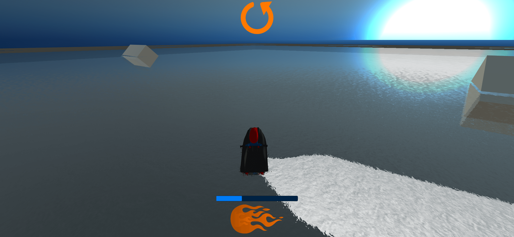
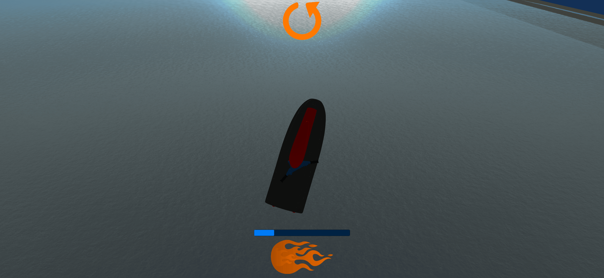

