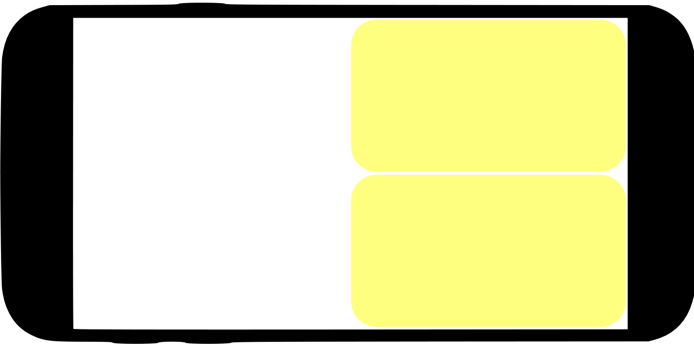
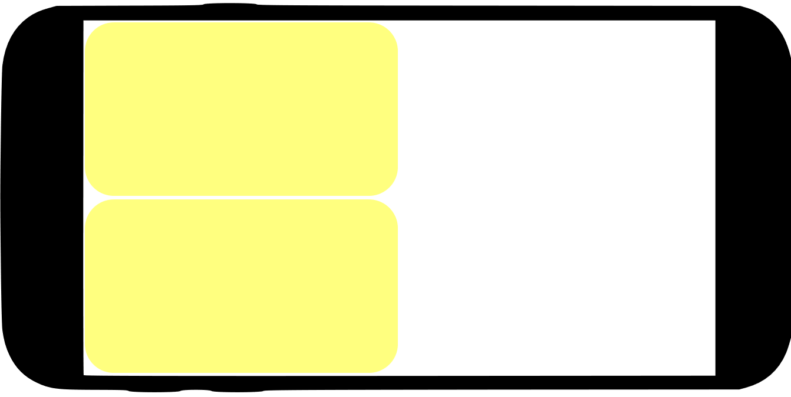
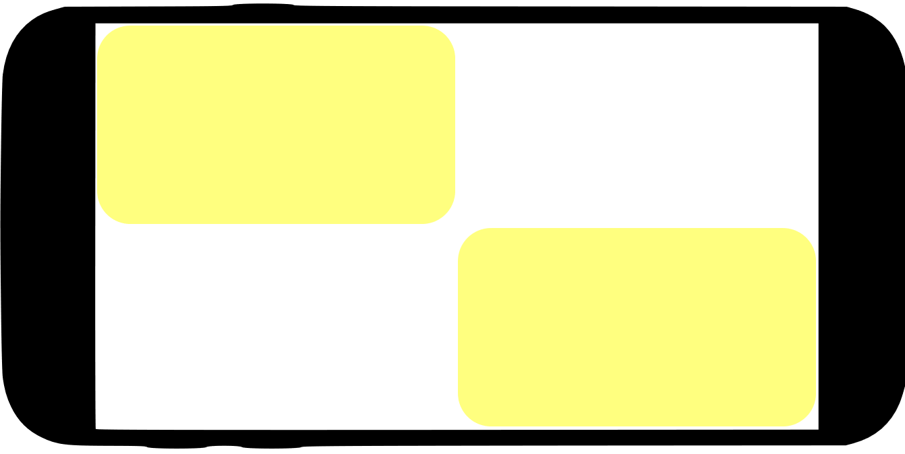

# WaveRyder

## Wave Ryder, ride waves with style and stunts.

# Stunt Guide
## Boosted
**Click on the boost button**

## Back-Flip

## Front-Flip

## Right-360

## Left-360

## Tunnel-Right

## Tunnel-Left

## Screenshots

